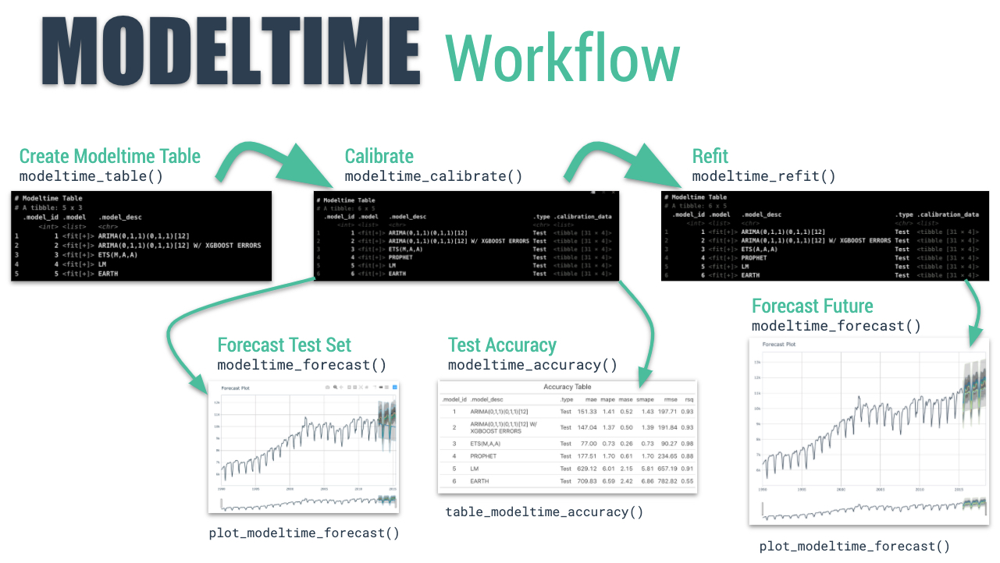

```{r, include = FALSE}
knitr::opts_chunk$set(
  collapse = TRUE,
  comment = "#>",
  
  out.width='100%',
  fig.align = "center",
  fig.width = 7,
  fig.height = 5,
  
  message = FALSE,
  warning = FALSE
)
```

In this short tutorial, we are going to see how to use `boostime` to apply two models: an arima + catboost and a prophet + lightGBM.

First, we load the libraries that we are going to use during this tutorial.

```{r}
library(tidymodels)
library(boostime)
library(modeltime)
library(tidyverse)
library(timetk)
library(lubridate)
# This toggles plots from plotly (interactive) to ggplot (static)
interactive <- FALSE
```

Next, we visualize the data that we are going to use once filtered:

```{r}
m750 <- m4_monthly %>% filter(id == "M750")

m750 %>%
  plot_time_series(date, value, .interactive = interactive)
```

Let’s split the data into training and test sets using `initial_time_split()` function:

```{r}
splits <- initial_time_split(m750, prop = 0.8)
```


## Model Generation

### Auto Arima + Catboost

In the first model, we will use an Arima model whose orders will be selected automatically through KPSS unit root tests. Subsequently, the residuals of this first model will be passed to a Catboost model. Finally, the output of both models is summed.

```{r}
model_arima_catboost <- boost_arima() %>%
                        set_engine("auto_arima_catboost", verbose = 0) %>%
                        fit(value ~ date + month(date), data = training(splits))

model_arima_catboost
```


### Prophet + Catboost

The second model will use Prophet followed by Catboost to model the residuals:

```{r}
model_prophet_catboost <- boost_prophet() %>%
                          set_engine("prophet_catboost", verbose = 0) %>%
                          fit(value ~ date + month(date), data = training(splits))

```

## Modeltime Integration

Here's the general process and where the functions fit. 

```{r, echo=F,  out.width="100%", fig.align='center', fig.cap="The Modeltime Workflow"}

```

So we will continue from step three.

### Step 3 - Add fitted models to a Model Table. 

The next step is to add each of the models to a Modeltime Table using `modeltime_table()`. This step does some basic checking to make sure each of the models are fitted and that organizes into a scalable structure called a ___"Modeltime Table"___ that is used as part of our _forecasting workflow._

We have 2 models to add.

```{r, paged.print = FALSE}
models_tbl <- modeltime_table(
    model_arima_catboost,
    model_prophet_catboost
)
models_tbl
```

### Step 4 - Calibrate the model to a testing set. 

Calibrating adds a new column, `.calibration_data`, with the test predictions and residuals inside. A few notes on Calibration:

- Calibration is how confidence intervals and accuracy metrics are determined 
- ___Calibration Data___ is simply forecasting predictions and residuals that are calculated from out-of-sample data.
- After calibrating, the calibration data follows the data through the forecasting workflow. 

```{r, paged.print = FALSE}
calibration_tbl <- models_tbl %>%
    modeltime_calibrate(new_data = testing(splits))
calibration_tbl
```

### Step 5 - Testing Set Forecast & Accuracy Evaluation

There are 2 critical parts to an evaluation.

- Visualizing the Forecast vs Test Data Set
- Evaluating the Test (Out of Sample) Accuracy

#### 5A - Visualizing the Forecast Test

Visualizing the Test Error is easy to do using the __interactive plotly visualization (just toggle the visibility of the models using the Legend).__ 

```{r}
calibration_tbl %>%
    modeltime_forecast(
        new_data    = testing(splits),
        actual_data = m750
    ) %>%
    plot_modeltime_forecast(
      .legend_max_width = 25, # For mobile screens
      .interactive      = interactive
    )
```

#### 5B - Accuracy Metrics

We can use `modeltime_accuracy()` to collect common accuracy metrics. The default reports the following metrics using `yardstick` functions:

- __MAE__ - Mean absolute error, `mae()`
- __MAPE__ - Mean absolute percentage error, `mape()`
- __MASE__ - Mean absolute scaled error, `mase()`
- __SMAPE__ - Symmetric mean absolute percentage error, `smape()`
- __RMSE__ - Root mean squared error, `rmse()`
- __RSQ__ - R-squared, `rsq()`

These of course can be customized following the rules for creating new yardstick metrics, but the defaults are very useful. Refer to `default_forecast_accuracy_metrics()` to learn more.

To make table-creation a bit easier, I've included `table_modeltime_accuracy()` for outputing results in either interactive (`reactable`) or static (`gt`) tables. 

```{r}
calibration_tbl %>%
    modeltime_accuracy() %>%
    table_modeltime_accuracy(
        .interactive = interactive
    )
```

### Step 6 - Refit to Full Dataset & Forecast Forward

The final step is to refit the models to the full dataset using `modeltime_refit()` and forecast them forward. 

```{r, paged.print = F, message=F}
refit_tbl <- calibration_tbl %>%
    modeltime_refit(data = m750)
refit_tbl %>%
    modeltime_forecast(h = "3 years", actual_data = m750) %>%
    plot_modeltime_forecast(
      .legend_max_width = 25, # For mobile screens
      .interactive      = interactive
    )
```


